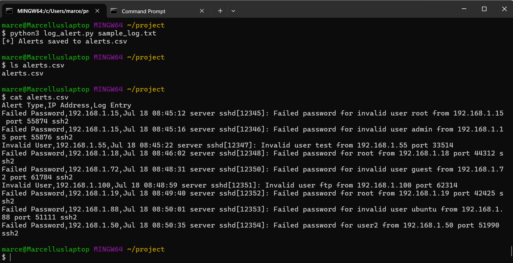

#  Log Alert Tool
>  Python tool to detect failed login attempts from system logs and generate structured alert reports in CSV format.
A Python-based log parsing tool that analyzes authentication logs for suspicious login activity, such as brute-force attempts, failed logins, or invalid users. It generates alerts into a structured CSV file — perfect for cybersecurity students, blue teamers, or anyone learning the fundamentals of threat detection.


---

##  Live Project Page  
 [https://marcellusharris.github.io/log-alert-tool/](https://marcellusharris.github.io/log-alert-tool/)

---

##  Key Features

- Detects suspicious login attempts (failed SSH, invalid users)
- Parses logs using Python regex
- Saves alerts to CSV for easy review or SOC integration
- Lightweight and beginner-friendly

---

##  Screenshot



---

## Real-World Scenario
This tool mimics a real SOC analyst workflow by scanning logs for brute-force attempts and privilege escalation behaviors. It’s a great stepping stone toward writing detection rules or building basic SIEM integrations.

Future Ideas
Real-time log monitoring with cron

Integrate with a simple alert dashboard

Add email notifications or webhook support

Port to PowerShell or Bash for cross-platform use

##  How to Use

### 1. Clone the Repo

```bash
git clone https://github.com/MarcellusHarris/log-alert-tool.git
cd log-alert-tool

2025-07-15T21:12:01,Failed SSH login,192.168.1.101,medium,"Failed password for root from 192.168.1.101 port 22 ssh2"
2025-07-15T21:13:00,Successful SSH login,192.168.1.10,info,"Accepted password for user1 from 192.168.1.10 port 22 ssh2"

## Screenshot

[](screenshot.png)

python log_alert.py sample-log.txt

Date,IP Address,Alert Type,Username
Jul 15 19:00:00,192.168.1.100,Invalid User,admin
Jul 15 19:01:00,192.168.1.105,Failed Password,root
